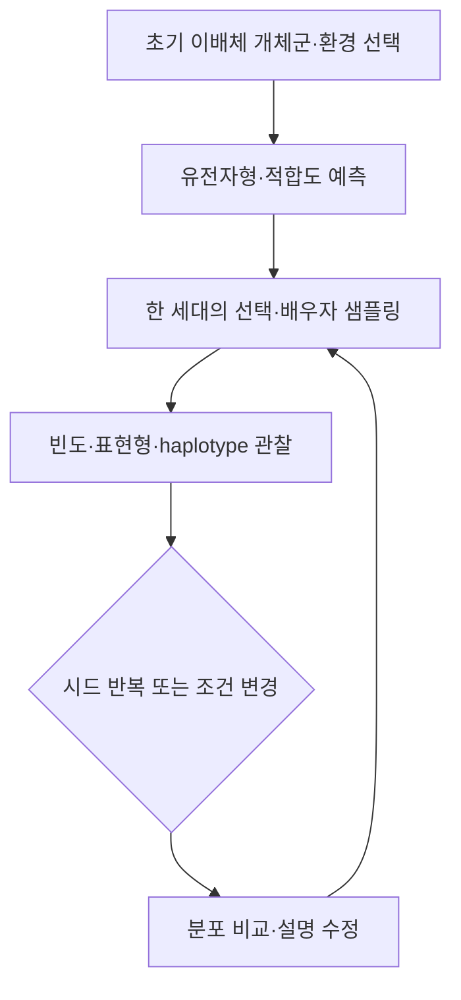

# 진화하는 섬

> 작성일: 2026-09-10 · 상태: 제작 전 설계 초안 v0.1  
> [전체 목록](README.md) · [공통 설계 기준](00-shared-design-principles.md)

## 1. 한눈에 보는 설계

한 종의 섬 개체군에서 두 유전자 좌위와 두 환경을 설정하고 세대 반복을 관찰하여 자연선택과 유전적 부동(drift)의 역할을 비교하는 확률형 탐구 웹앱입니다.

- 권장 대상: 중학교 후반~고등학교. 공식 교육과정 성취기준 인증을 뜻하지 않습니다.
- 선수 개념: 이배체·대립유전자·유전자형·표현형, 상대도수, 확률 표본.
- MVP: 한 종, 이배체 개체 N 프리셋 20/60/200(기본 60), 2좌위(A/a, B/b), 환경 2종, 세대 20회, 시드 반복. 한 실행 안에서 N은 고정합니다.
- 핵심 제한: 최소 생물학 유전 모형이며 실제 종의 적응·종분화·멸종 예측이 아닙니다.
- 목표 산출물: 대립유전자 빈도 그래프, 유전자형·표현형 표, 선택과 drift를 구분하는 설명입니다.

공통 기준을 독립 적용합니다. 밝은 테마, 단계별 필수 버튼 하나의 `gi-pulse`, 모션 감소 시 정적 강조, 작은 `업데이트 내역` 버튼을 사용합니다. VoiceOver 구현·검증과 TTS·음성 녹음은 제외합니다. 키보드·초점·텍스트 대안·320/360px·WebGL 대체를 검증합니다. 상태는 세션에만 있고 로그인·영구 저장·경쟁 점수·런타임 AI는 없습니다. 생성 이미지는 섬 풍경·개체 외형의 맥락용이며 빈도·측정값·자연선택의 증거가 아닙니다. 500줄이 넘는 코드는 유전 엔진, 시나리오, 렌더러, 화면으로 분리합니다.

## 2. 제품 목표와 학습 설계

### 제품 목표

학생이 한 세대의 개체 변화만 보고 “환경이 필요해서 유전자가 생겼다”라고 결론 내리지 않게 합니다. 같은 초기 개체군을 시드만 바꾸어 반복하고, 선택이 있는 조건과 중립 조건의 분포를 비교하게 합니다.

### 학습 목표

학생은 다음을 할 수 있어야 합니다.

1. 개체의 두 염색체에 있는 두 좌위의 대립유전자와 표현형을 표로 읽는다.
2. 부모의 감수분열에서 재조합률을 적용해 자녀의 두 대립유전자 조합을 만든다.
3. 환경별 생존·번식 가중치와 무작위 표본 추출을 구분한다.
4. 동일 조건을 여러 시드로 반복하고 평균 경향과 한 번의 변동을 따로 설명한다.
5. 작은 개체군에서 중립 대립유전자가 우연히 고정·소실될 수 있음을 그래프로 근거화한다.
6. 두 좌위의 조합이 환경별 적합도와 어떻게 연결되는지, 모형 밖 요인을 말한다.

### 예상 오개념과 개입

| 오개념 | 관찰 신호 | 개입 |
|---|---|---|
| 개체가 필요에 따라 유전자를 바꾼다 | 환경 전환 직후 대립유전자 생성 | 변이는 세대 전 기존 풀에서만 샘플 |
| 적합도가 높은 대립유전자는 반드시 고정된다 | 한 실행을 법칙으로 말함 | 시드 반복 분포와 중립 조건 비교 |
| 표현형 빈도와 대립유전자 빈도는 같다 | 이형접합을 한 표현형으로만 세지 않음 | 유전자형·대립유전자 표 분리 |
| 두 좌위는 항상 독립이다 | 재조합률 0에서도 균등 섞임 예상 | haplotype과 재조합 슬라이더 표시 |
| 큰 몸/밝은 색 자체가 진화의 방향이다 | 환경·번식 가중치 없이 결과 해석 | 적합도 표의 조건과 시드를 근거로 요구 |

## 3. 한 차시 흐름

### 50분 수업안

| 시간 | 활동 | 교사 질문 |
|---:|---|---|
| 0~6분 | 섬 환경과 첫 빈도 예측 | 빈도는 개체 수와 어떻게 연결되나요? |
| 6~15분 | 세대 1회 실행, 유전자형 카드 확인 | 선택과 추출 중 어디에 무작위가 있나요? |
| 15~27분 | 선택 유무·환경 A/B 비교 | 같은 개체군에서 왜 결과가 갈리나요? |
| 27~38분 | 시드 10회 반복 및 평균·범위 확인 | 한 번의 결과를 일반화할 수 있나요? |
| 38~47분 | 재조합률·개체군 크기 변경 | 어느 조건에서 좌위 조합이 유지되나요? |
| 47~50분 | 선택/drift 설명 카드 제출 | 그래프의 변동과 평균을 구분했나요? |



## 4. 구체 과제

### 과제 A: 유전자형에서 표현형 읽기

섬에는 A/a(색)와 B/b(부리) 두 좌위가 있습니다. MVP에서는 각 좌위가 완전 우성인 교육 가정으로 4개 표현형(색 우성/열성 × 부리 우성/열성)을 만듭니다. 학생은 두 haplotype으로 표현된 개체 6마리를 읽고 환경 A에서의 표현형과 적합도 카드를 연결합니다. 대립유전자 수, 개체 수, 표현형 수를 각각 세어 단위가 다름을 기록합니다.

### 과제 B: 선택과 drift 분리

초기 A 빈도 0.5, N=60에서 환경 A의 가중치를 주고 20세대를 실행한 뒤, 같은 가중치지만 시드를 10개 바꿉니다. 중립 조건을 별도 실행해 평균 경향과 분산을 비교합니다. 선택 실행 하나가 항상 같은 방향이라는 결론은 허용하지 않습니다.

### 과제 C: 환경 전환

10세대까지 환경 A, 이후 환경 B로 바꿉니다. 학생은 두 좌위 빈도와 표현형 빈도가 언제, 왜 달라지는지 표시하고, 전환 시점의 세대·가중치를 근거로 설명합니다.

### 과제 D: 재조합과 개체군 크기

재조합률 `r=0`, `0.5`와 N 프리셋 20, 60, 200을 비교합니다. 한 run 안에서 N은 세대마다 변하지 않습니다. 연관된 haplotype이 얼마나 유지되는지, 작은 N에서 drift 폭이 얼마나 커지는지 시드 반복 그래프로 관찰합니다. 세대마다 N이 변하는 변동 개체군은 후속입니다.

## 5. 화면과 조작

1. 상단: 세대, 환경 A/B, 시드, 반복 횟수, 초기화, 작은 `업데이트 내역` 버튼.
2. 왼쪽 Three.js 섬: 개체를 서식지 패치에 배치하고 외형은 표현형 카드로 표시합니다. 개체 선택은 설명용입니다.
3. 오른쪽 유전 패널: haplotype 표, 재조합률, 개체군 크기, 선택 가중치, 환경 전환 세대.
4. 하단: 대립유전자 빈도, genotype·phenotype 비율, haplotype 빈도, 시드별 작은 배수 그래프.
5. 필수 실행 버튼만 `gi-pulse`로 강조하고 모션 감소에서는 정적 테두리로 바꿉니다.
6. 색상 외에 A/a·B/b 문자, 패턴, 표를 함께 사용합니다. 빈도 그래프는 y축 0~1과 개체 수를 병기합니다.
7. 키보드는 개체·카드·슬라이더 이동, Enter 실행, Tab 패널 이동을 지원합니다. Esc는 선택 취소이며 초기화는 명시적 초기화 버튼으로만 실행합니다.
8. 좁은 화면에서는 유전 표→조건→실행→그래프 순으로 배치하고, WebGL 실패 시 2D 섬과 개체 목록으로 전환합니다.

## 6. 상태·입력·출력·단위

```ts
type Allele = "A" | "a" | "B" | "b";
type Haplotype = { locus1: "A" | "a"; locus2: "B" | "b" };
type Individual = { id: string; haplotypes: [Haplotype, Haplotype]; phenotype: string };
type IslandState = {
  generation: number; populationSize: 20 | 60 | 200; population: Individual[]; environment: "A" | "B";
  recombinationRate: number; fitnessByGenotype: Record<string, number>;
  mutationRate: number; seed: number; repeatCount: number;
};
```

- 내부 확률·빈도는 0~1, 개체 수는 정수, 세대는 0~20, 재조합률·돌연변이율은 MVP에서 각각 0~0.5·0으로 제한합니다.
- 출력 단위: 개체 수(마리), allele frequency(비율), genotype/phenotype 비율, haplotype 수, 세대.
- 경계: 암수·성비·세대 겹침·이주·돌연변이·질병은 고정 또는 0이며, 한 종의 교육용 개체군만 구현합니다.
- 환경의 fitness는 교사가 검수한 시나리오 상수입니다. 자연법칙의 보편 계수가 아닙니다.
- 범위를 벗어난 값은 자동 clamp하지 않고 오류와 수정 필드를 표시합니다.

## 7. 유전·선택·drift 알고리즘

개체군은 `N`마리의 이배체이며 총 allele copy 수는 `2N`입니다. 각 개체가 두 haplotype을 가지므로 두 좌위 조합은 유전자형과 별도입니다.

1. 각 개체의 haplotype 두 개로 genotype key를 만들고 환경별 `w_i`를 조회합니다. 두 좌위의 완전 우성 규칙으로 4개 표현형을 계산합니다.
2. 부모 선택 확률은 개체별 `P(parent=i)=w_i/sum_j(w_j)`로 정규화합니다. 모든 `w_i=0`이면 실행 오류를 냅니다.
3. 다음 세대의 `2N` 배우자 각각에 대해 부모를 한 번 선택한 뒤 배우자 하나를 만듭니다. 만든 유한 배우자 pool을 다시 복원추출하지 않습니다.
4. 부모 haplotype이 `AB/ab`라면 배우자는 `AB,ab`가 각각 `(1-r)/2`, `Ab,aB`가 각각 `r/2` 확률입니다. 각 배우자 두 개를 순서대로 묶어 N마리 이배체 자녀를 만듭니다. 이 복원추출·부모 선택 변동이 표본 drift를 만듭니다.
5. MVP 돌연변이율은 0입니다. 모든 새 대립유전자는 초기 풀에서 온다는 제한을 표시합니다.
6. 새 세대의 allele frequency는 `p_A=count(A copies)/(2N)`, `p_B=count(B copies)/(2N)`로 계산합니다. 표현형 빈도는 개체 수를 분모로 따로 계산합니다.
7. 중립 조건에서는 모든 `w_g=1`로 두어 선택을 제거하고 동일한 시드 묶음을 비교합니다. 선택 조건의 변화와 중립 조건의 변동을 함께 봅니다.
8. 반복 실험은 초기 상태를 복제하고 `seed+i`로 실행합니다. 평균, 중앙값, 10~90백분위 범위를 표시하되 한 반복을 법칙으로 표시하지 않습니다.

두 좌위의 연관은 MVP에서 haplotype 빈도 표로 표현합니다. 통계량 LD를 공식 성취로 요구하지 않으며, 후속에서 정의·해석을 검수한 뒤 추가합니다.

## 8. Three.js 역할과 이미지 자산

Three.js는 섬의 두 환경 패치, 개체 아이콘·외형, 세대 진행 시 개체 위치 변화를 표현합니다. 실제 개체 수·빈도·선택 판정은 엔진과 표·그래프가 담당합니다. WebGL 실패 시 2D 패치와 정렬된 개체 카드로 대체합니다.

Images 2.5 자산 후보는 9개입니다.

| assetId | 종류·수량 | 기준/변형 | 검수 기준 |
|---|---|---|---|
| island-base | 섬 항공 장면 1 | 기준 | 두 환경 패치 경계 고정 |
| organism-card | 개체 외형 4 | A/a·B/b 조합 | 표현형을 유전자 결정 사실로 과장 금지 |
| habitat-patch | 환경 장면 2 | 건조/습윤 변형 | 생존 확률 데이터 아님 |
| season-context | 맥락 장면 2 | 환경 A/B 변형 | 같은 카메라·지형 유지 |

프롬프트 예 1: “밝은 과학 교재용 가상 섬, 왼쪽은 건조한 바위 해안, 오른쪽은 습윤한 숲 패치, 작은 동일 종 개체가 보이지만 문자·숫자·그래프·유전 기호 없음, 생태 맥락 재구성.”

프롬프트 예 2: “같은 가상 개체·카메라·조명을 유지하고 외형 특성 한 가지만 바꾼 네 장의 비교 카드, 배경·크기·자세는 가능한 한 일정, 유전형과 빈도는 이미지에 넣지 않음.”

검수자는 기준/변형 불변 요소, 개체 외형과 유전자형의 매핑 캡션, `alt`, `caption`, `promptVersion`, `reviewStatus`를 확인합니다. 빈도·적합도·시드 결과는 이미지가 아니라 계산된 표·그래프에만 표시합니다.

## 9. 학습 피드백과 관찰 평가

오답 뒤에는 “이 변화는 대립유전자 생성인가요, 기존 복사본의 표본 추출인가요?” 같은 한 힌트를 제공합니다. 반복 실행 뒤에는 시드별 선을 숨기지 않고 평균과 범위를 함께 보여 줍니다. 자동 채점 대신 설명에 초기 N, 환경, 시드 반복, 그래프 근거가 포함되었는지 확인합니다.

교사는 다음을 관찰합니다.

- 이배체의 두 allele copy를 세는가.
- 선택 가중치와 무작위 표본을 구분하는가.
- 평균과 단일 반복을 구분하는가.
- 환경 전환 시 원인과 결과의 세대를 연결하는가.
- 모델의 고정 가정과 실제 진화의 차이를 말하는가.

세션 기록에는 초기 빈도, 조건, 시드, 세대별 요약, 설명만 남깁니다. 브라우저 종료 후 보존하지 않습니다.

## 10. 모듈과 데이터 구조

```text
src/domain/geneticsTypes.ts       이배체·haplotype·빈도 타입과 범위
src/engine/reproduction.ts        배우자·재조합·복원추출
src/engine/selection.ts           환경별 가중치와 세대 갱신
src/engine/repeats.ts             시드 반복·평균·백분위
src/scenarios/islandScenarios.ts  초기 집단·환경·계수·힌트
src/renderers/IslandScene.ts      Three.js 및 2D fallback
src/components/GeneticsPanel.tsx  유전 표·조건·필수 실행
src/components/PopulationCharts.tsx 그래프·반복 비교
src/assets/islandAssets.ts        생성 자산 메타데이터
```

시나리오는 `scenarioId`, `initialHaplotypes`, `fitnessByEnvironment`, `recombinationRate`, `repeatSeeds`, `sourceIds`를 포함합니다. 실행 결과에는 엔진 버전·시드·가정 ID를 남겨 재현성을 확보합니다.

## 11. MVP와 후속 단계

MVP는 N 프리셋 20/60/200(기본 60, 한 run 내 고정), 2좌위·4 haplotype, 환경 2종, 선택/중립 토글, 세대 20, 시드 반복 10회, 재조합률 0/0.5, 표·그래프·2D 대체 화면입니다. 후속은 세대마다 N이 변하는 개체군, 돌연변이·이주·성선택·실제 생물 사례·3좌위 이상·연관불평형 통계로 분리합니다. 종분화나 실제 섬 보전 예측 문구는 별도 교과·생물 검수 전 금지합니다.

## 12. 제작 후 검증 사례

| 사례 | 입력 | 기대 결과 |
|---|---|---|
| V1 복제성 | 동일 초기상태·seed=7 | 세대별 개체·빈도·표현형 결과가 동일 |
| V2 중립 기대 | N=60, 모든 w=1, 100개 시드 | 세대 1의 평균 allele frequency가 초기 p에 근접하고 반복별 변동은 남음. 통계적 기대이며 단일 실행 필연값 아님 |
| V3 선택 방향 | 환경 A에서 AA의 w가 높음 | 평균적으로 A 빈도가 증가하는 경향, 모든 시드의 단조 증가를 요구하지 않음 |
| V4 drift 크기 | 중립, N=20 vs N=200 | 작은 N의 반복 간 분산이 더 크게 나타나는지 통계적으로 비교 |
| V5 재조합 | r=0과 r=0.5, 연관 초기 haplotype | r=0에서 조합 보존, r=0.5에서 조합 섞임이 더 큼 |
| V6 환경 전환 | 10세대 A→B | 전환 이후 B에 유리한 genotype의 평균 변화 방향이 그래프에 표시 |
| V7 범위 오류 | r=0.8 또는 N=0 | 실행 불가, 값 자동 보정 없음 |
| V8 경계 빈도 | p(A)=0 또는 1, 중립, 돌연변이 0 | A 빈도는 모든 세대에서 각각 0 또는 1로 보존 |

문서 단계에서는 위 결과를 통과했다고 주장하지 않습니다. 구현 후 멘델 유전 기준 사례, 재조합 표본, 시드 재현성, 중립 평균·분산, 선택 조건, 반응형·키보드·WebGL 실패를 분리해 검증합니다.

## 13. 위험·미결정

- 2좌위·단순 fitness가 자연선택을 대표하는 것처럼 보일 수 있어 모든 결과에 “교육용 확률 모형”을 표시합니다.
- 환경별 가중치는 특정 종의 실측치가 아니며 임의의 정답을 생물학 사실로 설명하지 않습니다.
- 재조합·복원추출의 수학이 선수 개념을 넘을 수 있어 단계별 카드와 작은 N 예시를 제공합니다.
- 백분위·반복 횟수·허용오차와 교사의 평가 기록 양식은 프로토타입에서 정합니다.
- 개체 외형 이미지가 유전 결정론을 강화하지 않도록 표현형 환경 의존성 캡션을 검수해야 합니다.

## 14. 출처와 확인 상태

- [Sewall Wright, Evolution in Mendelian Populations, Genetics (1931)](https://doi.org/10.1093/genetics/16.3.290) — 이배체 Mendelian population에서 선택·구조·변이의 이론적 출발점을 확인했습니다. 2026-09-10 웹 확인. 본 앱의 2좌위 계수와 과제는 교육용 축소안입니다.
- [Wright–Fisher model introduction, PMC](https://pmc.ncbi.nlm.nih.gov/articles/PMC4269093/) — 유한한 이배체 개체군에서 비중첩 세대와 무작위 표본 추출이 유전적 drift를 만드는 단순 모델이라는 설명을 확인했습니다. 2026-09-10 웹 확인.
- [Wright and Fisher on Inbreeding and Random Drift, PMC](https://pmc.ncbi.nlm.nih.gov/articles/PMC2845331/) — 같은 수학의 해석 차이와 drift·근교계수의 역사적 관계를 참고했습니다. 2026-09-10 웹 확인.

## 15. 변경 이력

| 날짜 | 버전 | 내용 |
|---|---|---|
| 2026-09-10 | 0.1 | 2좌위 이배체·선택·시드 반복·drift 비교 MVP 초안 작성 |
